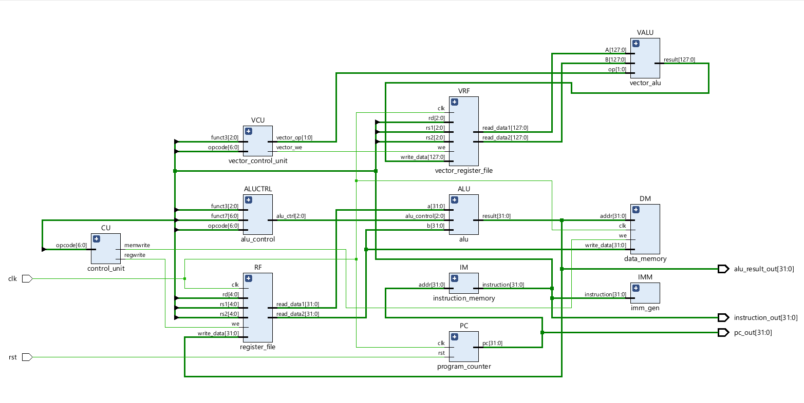
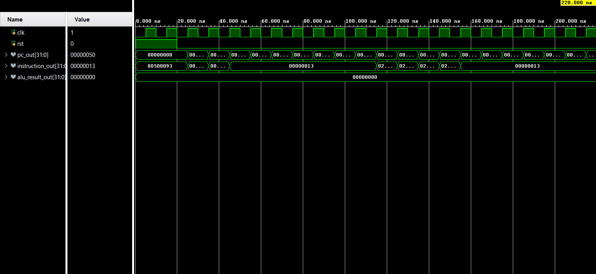

<p align="center">
  
</p>

# RVV-Inspired RISC-V Vector Processor

> Design and FPGA Implementation of a Low-Power RISC-V Vector Processing Unit with an RVV-Inspired Vector Extension


## Overview

This project presents the design, implementation, simulation, and FPGA realization of a **32-bit RV32I RISC-V processor** enhanced with an **RVV-inspired vector processing extension**. The processor is implemented in **Verilog HDL**, verified through **Vivado simulation**, and organized using a modular RTL architecture.

The design combines a conventional scalar execution pipeline with dedicated vector execution hardware to accelerate data-parallel operations. The vector subsystem operates on **128-bit vector registers** divided into **four 32-bit lanes**, enabling simultaneous execution of arithmetic and logical operations.

The project emphasizes modular design, hardware verification, FPGA implementation, and clear documentation, making it suitable for academic, research, and portfolio purposes.

## Table of Contents

- [Overview](#overview)
- [Features](#features)
- [Processor Specifications](#processor-specifications)
- [Processor Architecture](#processor-architecture)
- [Repository Structure](#repository-structure)
- [RTL Modules](#rtl-modules)
- [Behavioral Simulation](#behavioral-simulation)
- [FPGA Implementation](#fpga-implementation)
- [Verification Flow](#verification-flow)
- [Future Improvements](#future-improvements)
- [References](#references)
- [License](#license)

---

## Features

* 32-bit RV32I RISC-V Processor
* RVV-Inspired Vector Processing Extension
* 128-bit Vector Register File (4 × 32-bit lanes)
* Modular RTL Design in Verilog HDL
* Scalar and Vector Arithmetic Support
* Dedicated Vector ALU
* Vector Control Unit
* Parameterized Register Architecture
* Behavioral Simulation using Xilinx Vivado
* FPGA-Oriented Design Methodology
* Modular Testbenches for Verification
* Synthesizable RTL Architecture

## Processor Specifications

| Parameter        | Specification  |
| ---------------- | -------------- |
| ISA              | RV32I          |
| Processor Width  | 32-bit         |
| HDL              | Verilog        |
| Vector Width     | 128-bit        |
| Vector Registers | 8              |
| Vector Lanes     | 4 × 32-bit     |
| Simulation Tool  | Xilinx Vivado  |
| FPGA Target      | Xilinx Artix-7 |
| Design Style     | Modular RTL    |

## Processor Architecture

The proposed processor integrates a conventional RV32I scalar execution path with an RVV-inspired vector extension. The scalar datapath executes standard RISC-V instructions, while the vector subsystem accelerates data-parallel arithmetic using dedicated vector hardware.

The architecture consists of the following major modules:

- Program Counter
- Instruction Memory
- Control Unit
- Register File
- Immediate Generator
- ALU
- Data Memory
- Vector Control Unit
- Vector Register File
- Vector ALU

### RTL Schematic

<p align="center">
    
</p>

*Figure 1. RTL architecture generated using Xilinx Vivado.*

## Repository Structure

```text
RVV-Inspired-RISCV-Vector-Processor/
│
├── src/               # RTL source files
├── testbench/         # Verification environment
├── simulation/        # Waveforms and simulation screenshots
├── docs/              # Documentation and architecture
├── images/            # README images and banner
├── fpga/              # FPGA-related resources
├── README.md
├── LICENSE
└── .gitignore
```

## RTL Modules

| Module | Function |
|---------|----------|
| program_counter.v | Maintains instruction address |
| instruction_memory.v | Stores program instructions |
| control_unit.v | Generates processor control signals |
| register_file.v | Implements RV32I register bank |
| imm_gen.v | Generates immediate operands |
| alu.v | Executes arithmetic and logical operations |
| alu_control.v | Controls ALU functionality |
| data_memory.v | Implements load/store memory |
| vector_control_unit.v | Decodes vector instructions |
| vector_register_file.v | Stores vector operands |
| vector_alu.v | Executes vector operations |
| riscv_vector_processor.v | Integrates complete processor |

## Behavioral Simulation

The complete processor was verified using Xilinx Vivado Behavioral Simulation. Simulation validates:

- Reset operation
- Program Counter increment
- Instruction fetch
- ALU execution
- Scalar datapath functionality

<p align="center">
    
</p>

*Figure 2. Behavioral simulation waveform.*

## FPGA Implementation

The processor was synthesized and implemented in Xilinx Vivado targeting a Xilinx Artix-7 FPGA.

Implementation includes:

- RTL Elaboration
- Logic Synthesis
- Placement and Routing
- Timing Analysis
- Resource Utilization

## Verification Flow

The design followed a structured FPGA development methodology.

1. RTL Design
2. Module Verification
3. Testbench Development
4. Behavioral Simulation
5. RTL Elaboration
6. Logic Synthesis
7. Implementation
8. Timing Verification
9. FPGA Resource Analysis

## Future Improvements

- Pipeline implementation
- Hazard detection and forwarding
- Branch prediction
- RV32IM support
- Enhanced RVV compatibility
- AXI memory interface
- Cache subsystem

## References

1. The RISC-V Instruction Set Manual, Volume I: User-Level ISA.
2. The RISC-V Vector Extension (RVV) Specification.
3. AMD/Xilinx Vivado Design Suite User Guide.
4. Patterson, D. A., & Hennessy, J. L., *Computer Organization and Design: RISC-V Edition*.

## Conclusion

This project demonstrates the complete FPGA design flow for an RV32I processor enhanced with an RVV-inspired vector extension. From RTL development and verification to synthesis and implementation, the project highlights modular hardware design principles and serves as a foundation for future processor enhancements such as pipelining, cache integration, and extended vector support.

## License

This project is released under the MIT License.